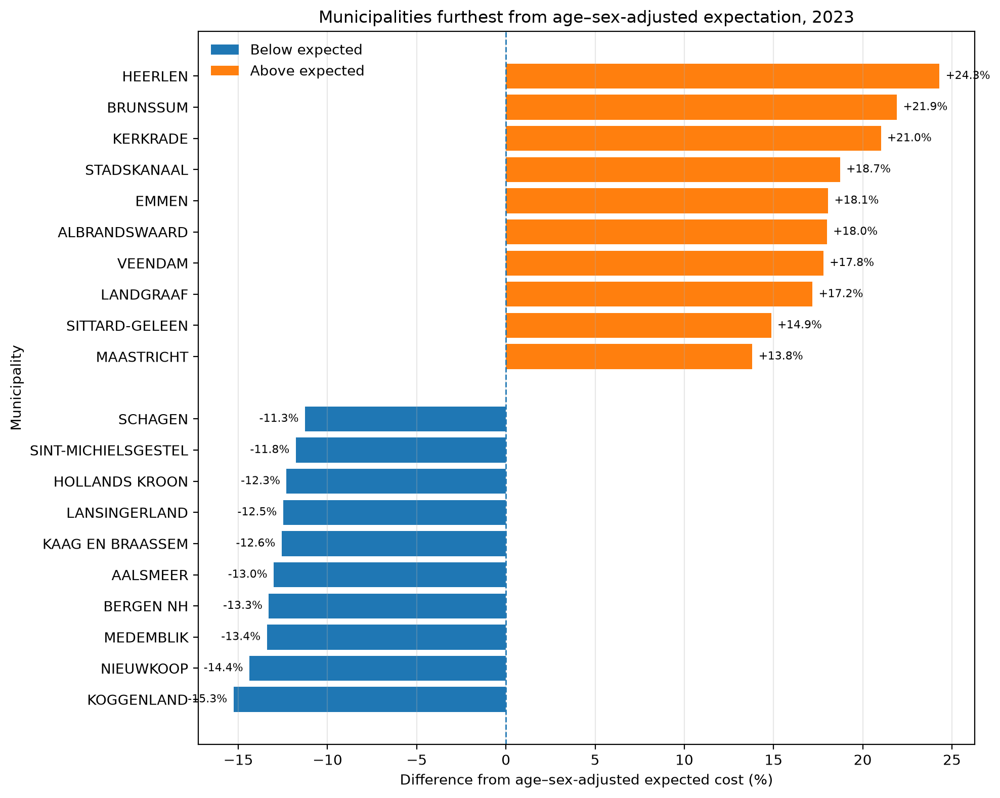
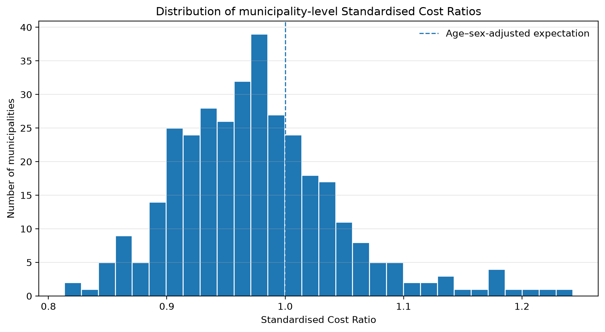
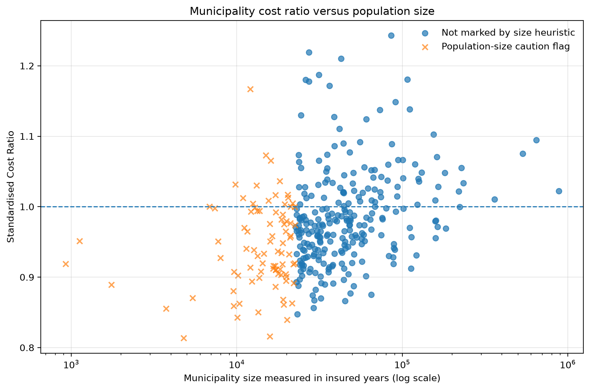
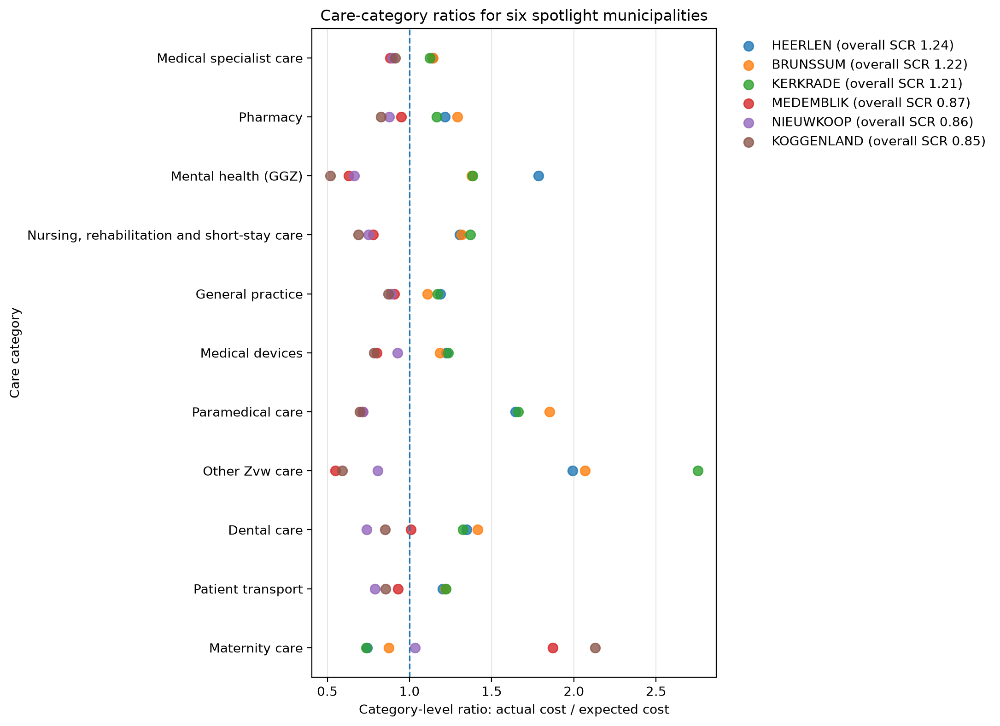

# Findings Report: Dutch Healthcare Cost Benchmark Analysis

**Author:** Mahdi Dadgar  
**Dataset:** Vektis Open Databestand Zorgverzekeringswet 2023 — municipality level  
**Analysis level:** Dutch municipalities  
**Method:** Indirect age–sex standardisation

---

## 1. Executive summary

This project investigates regional variation in Dutch healthcare costs using aggregated Vektis open data.

Raw healthcare expenditure is not directly comparable across municipalities because their populations differ in age and sex composition. A municipality with more older residents may reasonably have higher healthcare costs than a younger municipality.

To create a fairer comparison, I calculated an age–sex-adjusted expected cost for every municipality. Actual healthcare cost was then compared with this expected value using a Standardised Cost Ratio.

The analysis found that meaningful municipality-level variation remains after adjustment for age and sex.

Among municipalities not marked by the population-size caution heuristic, the strongest higher-than-expected signals were found in:

- Heerlen
- Brunssum
- Kerkrade
- Stadskanaal
- Emmen

The strongest lower-than-expected signals not marked by the heuristic included:

- Koggenland
- Nieuwkoop
- Medemblik
- Bergen NH
- Aalsmeer

These results should be interpreted as signals for further investigation. They do not establish that healthcare is inefficient, unnecessary, inappropriate, or of lower quality.

---

## 2. Analytical question

The central analytical question was:

> Which Dutch municipalities show higher or lower healthcare costs than expected after accounting for differences in age and sex composition?

A second objective was to identify which broader healthcare categories contributed most to the municipality-level differences.

---

## 3. Dataset and preparation

The original Vektis municipality-level file contained:

- 12,989 rows
- 342 municipalities
- 19 five-year age classes
- 2 sex categories
- 26 healthcare cost fields

One Vektis rest-category row did not contain usable municipality, age, or sex dimensions.

This row was excluded from municipality-level standardisation because its costs could not be assigned fairly to a municipality–age–sex group.

The final analytical dataset contained:

```text
12,988 rows
```

A fully populated combination of:

```text
342 municipalities × 19 age classes × 2 sex categories
```

would contain:

```text
12,996 municipality–age–sex combinations
```

Eight combinations were absent from the published dataset.

These missing combinations were documented but not imputed because the aggregated data did not provide defensible replacement values.

---

## 4. Data-quality results

The data-quality checks found:

| Check | Result |
|---|---:|
| Rows available for analysis | 12,988 |
| Municipalities | 342 |
| Age classes | 19 |
| Sex categories | 2 |
| Expected municipality–age–sex combinations | 12,996 |
| Observed municipality–age–sex combinations | 12,988 |
| Missing combinations | 8 |
| Duplicate combinations | 0 |
| Rest-category rows excluded | 1 |
| Zero or negative insured-year rows | 0 |
| Negative total healthcare-cost rows | 0 |
| Rest-category share of national healthcare cost | Approximately 0.24% |

The national actual and expected healthcare costs reconcile, apart from negligible floating-point precision.

The category-level costs also reconcile with the overall municipality totals.

---

## 5. Benchmarking method

### 5.1 National age–sex reference rates

For each age–sex group, I calculated a national healthcare cost rate:

```text
National age–sex cost rate =
Total healthcare cost in the age–sex group
÷
Total insured years in the age–sex group
```

Insured years were used as the exposure measure.

### 5.2 Expected municipality cost

For every municipality–age–sex combination:

```text
Expected cost =
Municipality insured years
×
National age–sex cost rate
```

The expected values were then summed across all age and sex groups within each municipality.

### 5.3 Standardised Cost Ratio

The main relative benchmark was:

```text
Standardised Cost Ratio =
Actual municipality healthcare cost
÷
Expected municipality healthcare cost
```

Interpretation:

- **SCR above 1.00:** actual costs are above the age–sex-adjusted expectation
- **SCR close to 1.00:** actual costs are close to the expectation
- **SCR below 1.00:** actual costs are below the expectation

### 5.4 Absolute euro gap

The analysis also calculated:

```text
Euro gap =
Actual municipality cost
-
Expected municipality cost
```

The two measures answer different questions:

- SCR measures proportional difference.
- Euro gap measures absolute financial scale.

A smaller municipality can have a large proportional difference but a relatively small euro gap. A larger municipality can have a moderate proportional difference but a substantial euro gap.

---

## 6. Main municipality results

### 6.1 Higher-than-expected costs

Among municipalities not marked by the population-size caution heuristic, the highest SCR values were:

| Municipality | SCR | Difference from expected |
|---|---:|---:|
| Heerlen | 1.243 | +24.3% |
| Brunssum | 1.219 | +21.9% |
| Kerkrade | 1.210 | +21.0% |
| Stadskanaal | 1.187 | +18.7% |
| Emmen | 1.181 | +18.1% |
| Albrandswaard | 1.180 | +18.0% |
| Veendam | 1.178 | +17.8% |
| Landgraaf | 1.172 | +17.2% |
| Sittard-Geleen | 1.149 | +14.9% |
| Maastricht | 1.138 | +13.8% |

Heerlen had the highest SCR in the complete municipality benchmark.

Its actual healthcare cost was approximately 24.3% above the amount expected from its age and sex composition.

### 6.2 Lower-than-expected costs

After excluding municipalities marked by the population-size heuristic, the lowest SCR values included:

| Municipality | SCR | Difference from expected |
|---|---:|---:|
| Koggenland | 0.847 | −15.3% |
| Nieuwkoop | 0.856 | −14.4% |
| Medemblik | 0.866 | −13.4% |
| Bergen NH | 0.867 | −13.3% |
| Aalsmeer | 0.870 | −13.0% |
| Kaag en Braassem | 0.874 | −12.6% |
| Lansingerland | 0.875 | −12.5% |
| Hollands Kroon | 0.877 | −12.3% |
| Sint-Michielsgestel | 0.882 | −11.8% |
| Schagen | 0.887 | −11.3% |

The lower end of the ranking was more sensitive to the population-size rule than the higher end.

This means the lower-than-expected municipality list should be interpreted with particular caution.

---

## 7. Population-size sensitivity

The source data does not provide the information required to calculate formal confidence intervals around municipality-level SCR values.

For this reason, I used a simple descriptive sensitivity heuristic.

Municipalities in the bottom quartile by insured years were marked with:

```text
small_population_caution_flag
```

The threshold was approximately:

```text
22,492 insured years
```

A total of:

```text
86 out of 342 municipalities
```

were marked.

The ranking comparison showed:

| Comparison | Result |
|---|---:|
| Top-10 overlap after excluding flagged municipalities | 9 of 10 |
| Bottom-10 overlap after excluding flagged municipalities | 2 of 10 |

This suggests:

- the higher-than-expected end of the ranking is relatively stable under this rule
- the lower-than-expected end is substantially more sensitive to municipality size

The relationship between municipality size and absolute SCR deviation was weak:

```text
Pearson association: −0.088
Spearman rank association: −0.168
```

These associations are descriptive and should not be interpreted as statistical evidence.

The caution flag is not a confidence interval and does not mean that non-flagged municipalities have formally reliable estimates.

---

## 8. Care-category analysis

The 26 detailed Vektis cost fields were grouped into 11 broader categories:

1. Dental care
2. General practice
3. Maternity care
4. Medical devices
5. Medical specialist care
6. Mental health care (GGZ)
7. Nursing, rehabilitation, and short-stay care
8. Other Zvw care
9. Paramedical care
10. Patient transport
11. Pharmacy

The same age–sex standardisation approach was applied separately to each category.

This produced two complementary category measures:

```text
Category ratio =
Actual category cost
÷
Expected category cost
```

and:

```text
Category euro gap =
Actual category cost
-
Expected category cost
```

### 8.1 Relative versus absolute drivers

A major analytical lesson was that the category with the highest relative ratio was not always the category with the largest absolute euro contribution.

For the three higher-SCR spotlight municipalities:

- Heerlen
- Brunssum
- Kerkrade

**Other Zvw care** produced the highest relative category ratio.

However, **medical specialist care** made the largest absolute positive euro contribution to the municipality-level gap.

Mental health care was also clearly above expectation in these municipalities, especially in Heerlen, but it was not consistently the highest relative or absolute contributor.

This distinction is important.

A small category can have a very high ratio while contributing fewer euros. A large category can have a more moderate ratio while generating a much larger absolute financial difference.

---

## 9. Visual interpretation

### 9.1 Municipalities furthest from expectation

The top-and-bottom comparison shows substantial variation after age–sex adjustment.



### 9.2 SCR distribution

The distribution shows that most municipalities are concentrated closer to an SCR of 1.00, while a smaller number form the higher and lower tails.



### 9.3 SCR and municipality size

Smaller municipalities are more visible at the lower end of the SCR distribution, but municipality size alone does not strongly explain absolute SCR deviation.



### 9.4 Category-level patterns

The category-level figure shows that different municipalities can arrive at similar overall SCR values through different combinations of healthcare categories.



---

## 10. What the findings do and do not mean

### The analysis supports statements such as:

- healthcare costs vary across municipalities after adjustment for age and sex
- some municipalities have actual costs materially above or below expectation
- ranking stability differs between the higher and lower ends
- category-level relative ratios and euro contributions provide different information
- the results can help identify priorities for further investigation

### The analysis does not support statements such as:

- a municipality is inefficient
- healthcare is unnecessary or inappropriate
- a hospital or clinician is responsible for the result
- lower expenditure means better healthcare
- higher expenditure means worse healthcare
- the observed differences are caused by socioeconomic or regional factors

The dataset does not contain enough information to make those conclusions.

---

## 11. Important limitations

The analysis has several limitations.

### Aggregated data

The dataset is municipality-level and aggregated.

Associations at municipality level cannot be assumed to apply to individual patients, clinicians, hospitals, or providers.

### Limited case-mix adjustment

The benchmark adjusts for:

- age
- sex

It does not adjust for:

- morbidity
- disease severity
- disability
- socioeconomic status
- deprivation
- urbanisation
- healthcare supply
- referral behaviour
- coding practices
- patient preferences

### One-year analysis

The project analyses 2023 only.

A single year may reflect temporary variation. A multi-year analysis would provide a stronger basis for identifying persistent patterns.

### No clinical outcomes

The dataset contains healthcare costs but not clinical outcomes or direct healthcare-quality measures.

### No formal uncertainty intervals

The population-size rule is a heuristic.

No formal statistical confidence interval, funnel plot, or significance test was calculated.

### No provider-level attribution

Municipality-level results cannot be attributed to individual hospitals, clinicians, insurers, or healthcare providers.

---

## 12. Possible next steps

A stronger extension of the project could include:

1. Multiple years of Vektis data to analyse persistence and trends.
2. Socioeconomic and deprivation indicators.
3. Urbanisation and regional healthcare-supply variables.
4. Morbidity or chronic-disease indicators.
5. Formal uncertainty intervals or funnel plots.
6. Spatial analysis of neighbouring municipalities.
7. Provider-level or hospital-level data where legally and ethically available.
8. Clinical outcome or quality indicators.
9. Statistical models that separate population composition from regional and provider effects.

---

## 13. Interview-ready explanation

A concise explanation of the project is:

> I used public Vektis healthcare-cost data to build an age–sex-adjusted municipality benchmark. Instead of comparing raw costs directly, I calculated national cost rates for each age and sex group and applied those rates to each municipality’s own population structure. I then compared actual and expected costs using a Standardised Cost Ratio and an absolute euro gap. The project showed that meaningful variation remains after adjustment, but I treated those results as investigation signals rather than evidence of inefficiency. I also added a population-size sensitivity check and a category-level analysis to distinguish relative ratios from absolute financial contributions.

---

## 14. Final conclusion

This project demonstrates how public healthcare-cost data can be transformed into a structured benchmark while preserving caution in interpretation.

The main conclusion is not that specific municipalities perform well or poorly.

The stronger conclusion is:

> Age–sex adjustment creates a more meaningful comparison than raw cost ranking, but municipality-level differences still require richer data and further investigation before they can support operational or policy conclusions.

The project therefore functions as a decision-support and hypothesis-generation analysis rather than a performance judgement.